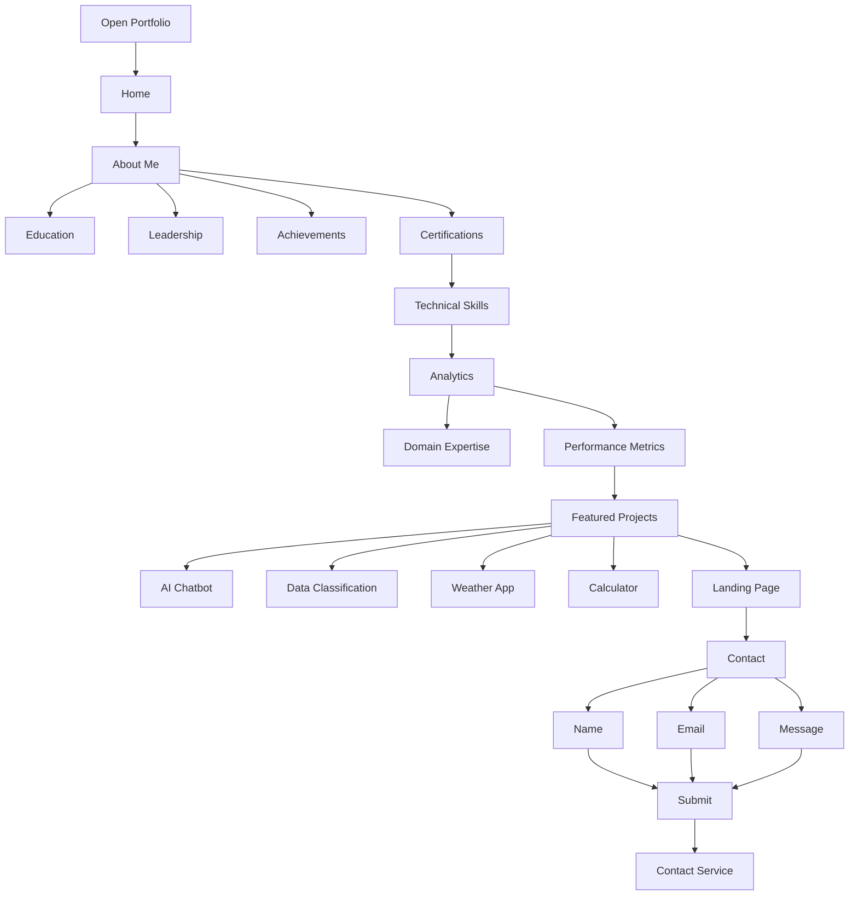
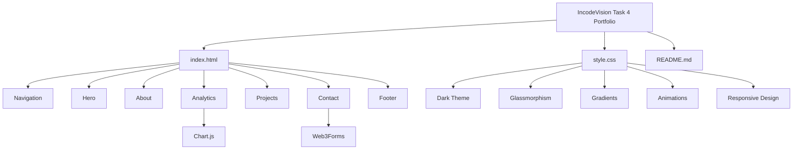

<p align="center">
  
</p>
<p align="center">
  <strong>AI & ML Engineer • Frontend Developer • Data Analytics Enthusiast</strong>
</p>


<p align="center">
  
  
  
  
  
</p>

---

# 💼 Personal Portfolio

### AI & Machine Learning | Frontend Development | Data Analytics

Welcome to my personal portfolio website — a modern and responsive digital space showcasing my **technical skills, education, achievements, projects, certifications, and professional experience**.

The portfolio was created as part of the **IncodeVision Internship — Task 4** with a focus on building a professional frontend experience using HTML, CSS, JavaScript, and interactive data visualization.

---

## 🌐 Live Portfolio

<p align="center">

### 🚀 Explore My Portfolio

<a href="https://vaishnavibansal222-ctrl.github.io/IncodeVision-Task4-Portfolio/">

</a>

</p>

---

# 👩‍💻 About Me

Hi! I'm **Vaishnavi Bansal**, a B.Tech student specializing in **Artificial Intelligence & Machine Learning**.

I am interested in building practical solutions using:

- 🤖 Artificial Intelligence
- 🧠 Machine Learning
- 📊 Data Analytics
- 🐍 Python
- 🌐 Web Development
- 🎨 Modern UI/UX

I enjoy combining **technology, data, and creative frontend development** to build useful and visually engaging applications.

---

# ✨ Portfolio Features

| Feature | Description |
|:---|:---|
| 🏠 **Hero Section** | Personal introduction with professional call-to-action |
| 👩‍💻 **About Me** | Education, leadership, achievements and certifications |
| 🛠️ **Skills** | Technical skills displayed through interactive elements |
| 📊 **Analytics** | Visual representation of skills and model-related metrics |
| 💻 **Projects** | Featured AI/ML and frontend projects |
| 📩 **Contact** | Contact form for communication and opportunities |
| 🎨 **Modern UI** | Dark glassmorphism-inspired interface |
| 📱 **Responsive** | Optimized for different screen sizes |
| ✨ **Animations** | Smooth transitions and hover interactions |
| 🚀 **Deployment** | Hosted through GitHub Pages |

---

# 🧰 Tech Stack

### Frontend

```text
HTML5
CSS3
JavaScript
```

### Visualization

```text
Chart.js
```

### Services

```text
Web3Forms
Google Fonts
GitHub Pages
```

---

# 🛠️ Technical Skills

The portfolio highlights my knowledge and interests across:

```text
🐍 Python
🤖 Machine Learning
🧠 Artificial Intelligence
📊 Data Analytics
🗄️ MySQL
📈 Power BI
🌐 HTML5
🎨 CSS3
⚡ JavaScript
⚛️ React.js
💻 C Programming
```

---

# 📊 Analytics Dashboard

The portfolio contains an interactive analytics section designed to visually present technical and model-related information.

### 📈 Included Visualizations

```text
📊 Domain Expertise
📈 Model / Performance Metrics
📌 Interactive Charts
📱 Responsive Analytics Layout
```

The visualizations are implemented using **Chart.js**.

---

# 🚀 Featured Projects

## 🤖 Rule-Based AI Chatbot

A Python-based chatbot that uses predefined rules and responses to interact with users.

**Focus:**

```text
Python
Rule-Based AI
Conversation Logic
```

---

## 🧠 Data Classification Using AI

A machine-learning classification project focused on processing data and predicting categories using supervised learning techniques.

**Focus:**

```text
Python
Machine Learning
Scikit-Learn
Data Analytics
```

---

## 🌦️ ApexWeather

A modern weather application providing real-time weather information through API integration.

**Features:**

```text
City Search
Temperature
Humidity
Wind Speed
Weather Conditions
API Integration
```

**Technology:**

```text
React
JavaScript
CSS
Open-Meteo API
```

---

## 🧮 Pro Interactive Calculator

A modern interactive calculator designed with a clean glassmorphism interface and responsive layout.

**Technology:**

```text
HTML
CSS
JavaScript
```

---

## 🌐 Modern Landing Webpage

A responsive modern landing page demonstrating frontend design, layout, styling, and interactive UI elements.

**Technology:**

```text
HTML5
CSS3
JavaScript
Responsive Design
```

---

# 🎨 UI / UX Design

The portfolio follows a modern dark visual system.

### Design Language

```text
🌑 Dark Background
💎 Glassmorphism
🔵 Cyan Highlights
🟣 Indigo Gradients
✨ Glow Effects
🎞️ Smooth Animations
🖱️ Hover Interactions
📱 Responsive Layout
```

The design focuses on creating a **professional developer portfolio with a modern technology-oriented aesthetic**.

---

# 🔄 Portfolio Workflow



---

# 🏗️ Project Architecture



---

### `index.html`

The main HTML file contains the complete portfolio structure:

```text
Navigation
    ↓
Hero
    ↓
About
    ↓
Skills
    ↓
Analytics
    ↓
Projects
    ↓
Contact
    ↓
Footer
```

### `style.css`

The stylesheet controls:

```text
🎨 Colors
📐 Layout
💎 Glass Effects
✨ Animations
🖱️ Hover Effects
📱 Responsive Design
📊 Cards & Charts
```

---

# 📱 Responsive Design

The portfolio is designed to provide a consistent experience across:

```text
💻 Desktop
💻 Laptop
📱 Tablet
📱 Mobile
```

Responsive styling adjusts navigation, content layout, typography, cards, buttons, and analytics sections for smaller screens.

---

# 📩 Contact Section

The portfolio provides a contact form where visitors can enter:

```text
👤 Name
📧 Email
💬 Message
```

The form is integrated with **Web3Forms** for handling submissions.

---

# ⚙️ Run Locally

### 1. Clone the Repository

```bash
git clone https://github.com/vaishnavibansal222-ctrl/IncodeVision-Task4-Portfolio.git
```

### 2. Navigate to the Project

```bash
cd IncodeVision-Task4-Portfolio
```

### 3. Open the Website

Open:

```text
index.html
```

in your browser.

### Recommended

For development, open the project using **VS Code** and use the **Live Server** extension.

---

# 🚀 Deployment

This portfolio is hosted using **GitHub Pages**.

### Deployment Workflow

```text
Local Development
       ↓
    Git
       ↓
   GitHub
       ↓
GitHub Pages
       ↓
Live Portfolio
```
---

# 🎯 IncodeVision Internship — Task 4

This project was developed as part of the **IncodeVision Internship**.

### Objective

The goal was to create a professional portfolio website that demonstrates:

```text
✓ Frontend Development
✓ Responsive Web Design
✓ Personal Branding
✓ Project Presentation
✓ Interactive Visualization
✓ UI / UX Design
✓ Contact Integration
✓ GitHub Deployment
```

---

# 🔮 Future Improvements

Potential improvements for future versions include:

- 📄 Online Resume / CV download
- 🌙 Theme switcher
- 📝 Personal blog section
- 🏆 Dedicated certifications page
- 📊 More advanced analytics
- ✨ Advanced scroll animations
- 🔗 Individual GitHub project links
- 📱 Progressive Web App support
- 🌐 Multi-language support
- 📬 Improved contact notifications

---

# 📈 Project Snapshot

```text
┌─────────────────────────────────────────┐
│         VAISHNAVI BANSAL PORTFOLIO      │
├─────────────────────────────────────────┤
│                                         │
│  🎓 B.Tech AIML                         │
│  🤖 Artificial Intelligence              │
│  🧠 Machine Learning                    │
│  📊 Data Analytics                      │
│  💻 Frontend Development                │
│  📈 Interactive Analytics               │
│  🚀 GitHub Pages                        │
│                                         │
└─────────────────────────────────────────┘
```

---
# 👩‍💻 Developer
Vaishnavi Bansal

AI / ML & Web Development Enthusiast
IncodeVision Internship Project

# 🤝 Let's Connect

<p align="center">

<a href="YOUR_LINKEDIN_URL">

</a>

<a href="mailto:YOUR_EMAIL">

</a>

<a href="https://github.com/vaishnavibansal222-ctrl">

</a>

</p>

---

# ⭐ Show Your Support

If you like this project:

⭐ Star the repository  
🍴 Fork the repository  
📢 Share it with your network

---

<p align="center">

### 💙 Thanks for Visiting!

</p>

<p align="center">
  
</p>


   
   
